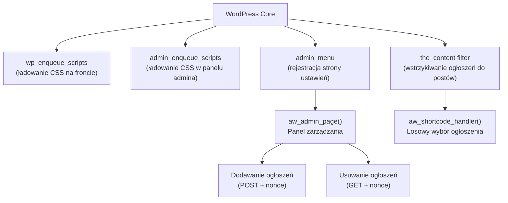
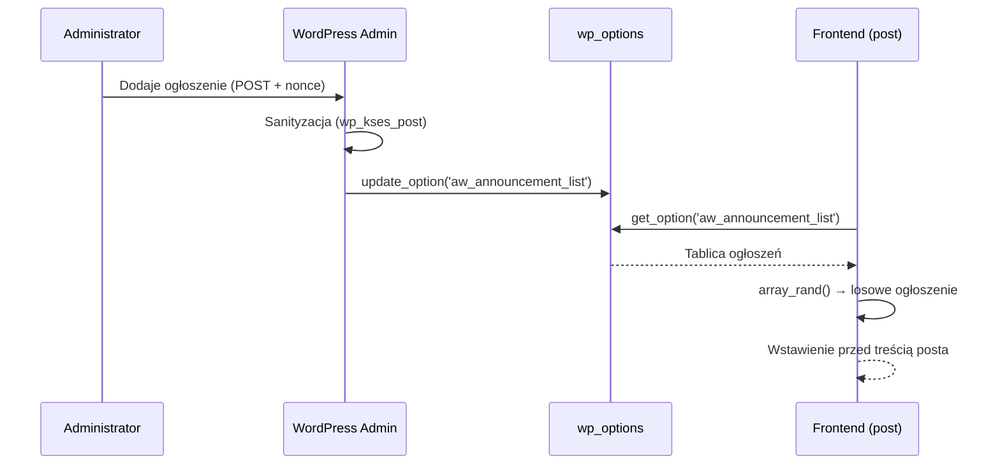

# Raport: Analiza pluginu Announcement Writer

> **Plik:** [AnnoucmentWriter.php](file:///c:/xampp/htdocs/wordpress/wp-content/plugins/AnnoucmentWriter/AnnoucmentWriter.php)
> **Autorzy:** Mikołaj Kamiński, Wojciech Król
> **Wersja:** 1.0

---

## 1. Cel pluginu

Plugin wyświetla **losowe ogłoszenie HTML** między tytułem a treścią każdego posta w WordPressie. Administrator zarządza ogłoszeniami przez panel w menu **Ustawienia → Announcement Writer**.

## 2. Struktura pliku

```
AnnoucmentWriter/
├── AnnoucmentWriter.php   ← główny plik pluginu (124 linie)
├── css/style.css           ← style CSS (29 linii)
├── js/                     ← pusty katalog
└── image/                  ← katalog na zasoby graficzne
```

## 3. Architektura kodu — przegląd



## 4. Szczegółowy opis działania

### 4.1 Ładowanie stylów CSS (linie 15–23)

| Hook | Kiedy działa | Co ładuje |
|---|---|---|
| `wp_enqueue_scripts` | Na frontendzie (strona publiczna) | [css/style.css](file:///c:/xampp/htdocs/wordpress/wp-content/plugins/AnnoucmentWriter/css/style.css) — styl `.aw-announcement-box` |
| `admin_enqueue_scripts` | Tylko na stronie `settings_page_aw` | Ten sam [css/style.css](file:///c:/xampp/htdocs/wordpress/wp-content/plugins/AnnoucmentWriter/css/style.css) — style formularza i tabeli |

Warunek `$hook === 'settings_page_aw'` zapewnia, że CSS admina ładuje się **wyłącznie** na stronie ustawień pluginu, nie na wszystkich stronach panelu.

### 4.2 Rejestracja strony w menu (linie 25–33)

```php
add_options_page('Random Announcement Writer', 'Announcement Writer',
                 'manage_options', 'aw', 'aw_admin_page');
```

- Dodaje stronę pod **Ustawienia → Announcement Writer**
- Wymaga uprawnienia `manage_options` (tylko administratorzy)
- Slug strony: [aw](file:///c:/xampp/htdocs/wordpress/wp-content/plugins/AnnoucmentWriter/AnnoucmentWriter.php#35-105)
- Callback: funkcja [aw_admin_page()](file:///c:/xampp/htdocs/wordpress/wp-content/plugins/AnnoucmentWriter/AnnoucmentWriter.php#35-105)

### 4.3 Panel administracyjny — [aw_admin_page()](file:///c:/xampp/htdocs/wordpress/wp-content/plugins/AnnoucmentWriter/AnnoucmentWriter.php#35-105) (linie 35–104)

Główna funkcja zarządzania. Składa się z trzech bloków:

#### A) Dodawanie ogłoszenia (linie 43–52)

```
POST → sprawdzenie nonce → sanityzacja → zapis do wp_options
```

1. Sprawdza `$_POST['aw_save_announcement']` i weryfikuje nonce (`check_admin_referer('aw_add')`)
2. Sanityzuje treść funkcją `wp_kses_post()` (dozwolone: bezpieczne tagi HTML)
3. Pobiera listę ogłoszeń z `wp_options`, dodaje nowe, zapisuje z powrotem
4. Wyświetla komunikat sukcesu

#### B) Usuwanie ogłoszenia (linie 54–64)

```
GET → sprawdzenie nonce → usunięcie z tablicy → reindeksacja → zapis
```

1. Sprawdza `$_GET['delete']` i weryfikuje nonce (`check_admin_referer('aw_delete_' . id)`)
2. Pobiera listę, usuwa element po indeksie, reindeksuje tablicę (`array_values`)
3. Zapisuje zaktualizowaną listę

#### C) Renderowanie interfejsu HTML (linie 66–103)

- Formularz `<form method="post">` z `<textarea>` i przyciskiem submit
- Tabela `wp-list-table` z listą aktywnych ogłoszeń
- Każde ogłoszenie ma przycisk "Delete" z adresem URL zawierającym nonce

### 4.4 Shortcode `[random_announcement]` (linie 106–116)

```php
function aw_shortcode_handler() {
    $announcements = get_option('aw_announcement_list', []);
    if (empty($announcements)) return '';
    $announcement = $announcements[array_rand($announcements)];
    return '<div class="aw-announcement-box">' . $announcement . '</div>';
}
```

- Pobiera listę ogłoszeń z `wp_options`
- Losuje jedno za pomocą `array_rand()`
- Zwraca je opakowane w `<div class="aw-announcement-box">`

### 4.5 Filtr `the_content` (linie 118–123)

```php
add_filter('the_content', function ($content) {
    if (is_single() && is_main_query()) {
        $content = do_shortcode('[random_announcement]') . $content;
    }
    return $content;
});
```

- Działa **tylko** na pojedynczych postach (`is_single()`) i głównym zapytaniu
- Wstawia wynik shortcode'a **przed** treścią posta

## 5. Przechowywanie danych

| Klucz opcji | Typ | Opis |
|---|---|---|
| `aw_announcement_list` | `array` | Indeksowana tablica ciągów HTML z treściami ogłoszeń |

Dane przechowywane w tabeli `wp_options` WordPressa — brak własnych tabel w bazie danych.

## 6. Zabezpieczenia

| Mechanizm | Obecny? | Szczegóły |
|---|---|---|
| Sprawdzenie uprawnień | ✅ | `current_user_can('manage_options')` + `manage_options` w `add_options_page` |
| CSRF (nonce) — dodawanie | ✅ | `wp_nonce_field('aw_add')` + `check_admin_referer('aw_add')` |
| CSRF (nonce) — usuwanie | ✅ | `wp_nonce_url('aw_delete_' . $id)` + `check_admin_referer('aw_delete_' . $id)` |
| Sanityzacja danych wejściowych | ✅ | `wp_kses_post()` + `wp_unslash()` |
| Escapowanie wyjścia | ⚠️ Częściowe | `esc_url()` na URL-ach usuwania, ale treść ogłoszeń renderowana bez escapowania (zamierzone — HTML) |
| Metoda HTTP dla operacji zapisu | ⚠️ | Usuwanie przez GET zamiast POST |

> [!WARNING]
> **Usuwanie ogłoszeń odbywa się przez GET** — jest to niezgodne z najlepszymi praktykami (RFC 7231). Żądania GET z nonce mogą wyciec przez logi serwera, historię przeglądarki lub pre-fetching.

## 7. Wzorce i konwencje

- **Prefiks [aw_](file:///c:/xampp/htdocs/wordpress/wp-content/plugins/AnnoucmentWriter/AnnoucmentWriter.php#35-105)** — wszystkie funkcje i opcje mają unikalny prefix, co zapobiega kolizjom nazw
- **Hooki WordPress** — plugin korzysta z `add_action`, `add_filter`, `add_shortcode`
- **Anonimowe funkcje (closures)** — użyte dla hooków ładujących CSS i filtra `the_content`
- **Funkcje nazwane** — [aw_admin_page()](file:///c:/xampp/htdocs/wordpress/wp-content/plugins/AnnoucmentWriter/AnnoucmentWriter.php#35-105) i [aw_shortcode_handler()](file:///c:/xampp/htdocs/wordpress/wp-content/plugins/AnnoucmentWriter/AnnoucmentWriter.php#108-117) — dla callbacków rejestrowanych przez nazwę

## 8. Styl CSS ([style.css](file:///c:/xampp/htdocs/wordpress/wp-content/plugins/AnnoucmentWriter/css/style.css))

| Klasa CSS | Zastosowanie |
|---|---|
| `.aw-form-container` | Kontener formularza dodawania (biały, z obramowaniem) |
| `.aw-announcements-table` | Tabela listy ogłoszeń (max 800px) |
| `.aw-delete-btn` | Przycisk usuwania (czerwony) |
| `.aw-announcement-box` | Ramka ogłoszenia na froncie (szare tło, niebieska krawędź lewa) |

## 9. Podsumowanie przepływu danych


